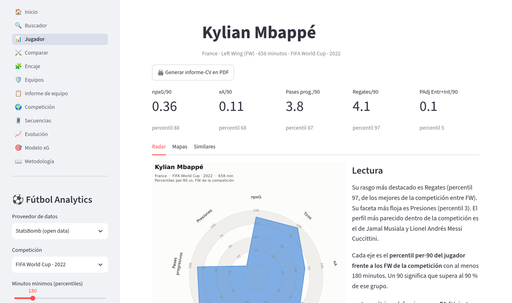

# futbol-analytics

[](https://github.com/joseadam03/futbol-analytics/actions/workflows/ci.yml)

**[▶ Probar la app en vivo](https://futbol-analytics.streamlit.app/)** — sin instalar nada.

Cojo los datos de eventos abiertos de un Mundial o una Euro y le pregunto al
dato lo que un ojeador pregunta de memoria: ¿a qué se parece este jugador?,
¿en qué equipo rendiría mejor?, ¿es su volumen de tiros suerte o es de
verdad? Por ejemplo: según el modelo de similitud, el perfil de Kylian
Mbappé en el Mundial 2022 es el más parecido... al de Messi — no por ojo,
por el mismo vector de métricas per-90 estandarizadas que ves en la app.

Construido para demostrar cómo trabajo con datos deportivos: métricas per-90,
percentiles por rol, un **modelo de xG propio** validado con cross-validation
anidada (nada de train=test), un motor de **encaje jugador–equipo**, e
informes-CV en PDF listos para mandar. Con interfaz web, CLI, y una suite de
tests + CI/CD como la de cualquier servicio en producción — no solo notebooks.



> Proyecto de portafolio. El objetivo no es acumular gráficos, sino medir bien:
> cada métrica está definida abajo, con sus supuestos y sus limitaciones.

## La app

```bash
pip install -r requirements.txt && pip install --no-deps -e .
streamlit run streamlit_app.py
```

**En Windows**: con [Python 3.11+](https://www.python.org/downloads/) instalado
(marcando *Add Python to PATH*), doble clic en `run_windows.bat`. La primera vez
crea el entorno virtual e instala las dependencias; después arranca directo y
abre la app en el navegador.

¿Sin ganas de esperar a la primera descarga? `make demo` arranca al instante
sobre una liga sintética (`FUTBOL_ANALYTICS_FAKE=1`), sin red y con dos equipos
de estilos opuestos para que todas las páginas tengan algo que contar.

Multipágina, con navegación propia:

- **Inicio** — resumen de la competición y jugadores destacados.
- **Buscador** — localiza a cualquier jugador: si está en la competición cargada
  salta a su informe completo; si no está en los open data, muestra su ficha
  informativa vía TheSportsDB, sus **estadísticas de temporada reales** vía
  Sportmonks (goles, asistencias, minutos, apariciones — con token configurado),
  botón para descargar esa ficha como **informe-CV en PDF** (foto, biografía y
  estadísticas de temporada) y enlaces para seguir el scouting fuera.
- **Jugador** — radar de percentiles per-90, mapas de campo (calor de toques,
  pases progresivos/clave, tiros con tamaño ∝ xG), perfiles similares con foto,
  una **lectura en lenguaje llano** generada por reglas sobre los mismos
  percentiles (nada de texto inventado, todo trazable a la tabla) y botón para
  generar el **informe-CV en PDF de una página**.
- **Comparar** — radar superpuesto de dos jugadores (por defecto, el más similar)
  con tabla de valores y percentiles lado a lado.
- **Encaje** — motor de encaje jugador–equipo: a qué equipos les encaja un
  jugador y qué fichajes le encajan a un equipo, cruzando el estilo del equipo
  (posesión, presión, verticalidad) con los rasgos per-90 del jugador y la
  mejora que aporta al nivel del puesto (por **rol fino** y ponderada por
  minutos). Pesos ajustables, mapa de estilo de la competición, descarga en CSV
  y pool ampliable con otras competiciones ya cacheadas.
- **Equipos** — posesión, **PPDA** (intensidad de presión), npxG a favor y en
  contra por partido, y dispersión posesión vs. dominio.
- **Informe de equipo** — cómo juega, no solo cuánto rinde: radar de estilo en
  tres familias (**ritmo**, **presión** y **progresión**) con percentiles de la
  competición, lectura en prosa y tabla descargable.
- **Competición** — dispersión interactiva de todos los jugadores (ejes a elegir,
  tooltip con nombre) y tabla completa descargable en CSV.
- **Secuencias** — de dónde nacen las ocasiones de cada equipo: origen de la
  posesión (juego elaborado, córner, robo alto, contragolpe), pases previos al
  tiro, duración y velocidad directa, con el mapa elaboración vs. verticalidad.
- **Evolución** — el rendimiento partido a partido con media móvil y npxG
  acumulado, para equipo y jugador: una media de temporada esconde las rachas.
- **Modelo xG** — dos modelos propios comparados fuera de muestra: uno
  geométrico (distancia, ángulo, cabeza) y otro **contextual**, que añade
  presión, defensores en el cono de tiro y posición del portero desde el
  *freeze frame*. Gana el que mejor calibra, con curva de fiabilidad, Brier
  score y coeficientes interpretables.
- **Metodología** — definición exacta de cada métrica dentro de la propia app.
- **Modo claro y oscuro**: los gráficos siguen el tema del usuario con una paleta
  validada para accesibilidad y daltonismo en ambas variantes.
- Todos los gráficos con botón de **descarga en PNG** para presentaciones.
- Fotos de jugadores vía TheSportsDB (gratuita; puede faltar alguna).

## Desplegar

**Streamlit Community Cloud** (gratis): en [share.streamlit.io](https://share.streamlit.io),
conecta tu GitHub, elige este repositorio, la rama `main` y el fichero principal
`streamlit_app.py`. `requirements.txt` lleva `-e .` como primera línea (se
regenera así en `make lock`) para que Cloud instale también el paquete propio,
ya que solo ejecuta `pip install -r requirements.txt` — sin eso, la app
reventaría al arrancar por no encontrar `futbol_analytics`. En *Advanced
settings* puedes fijar la versión de Python (3.11 o 3.12) y, si vas a activar
Wyscout, añadir `WYSCOUT_CLIENT_ID` / `WYSCOUT_CLIENT_SECRET` en *Secrets*; para
las estadísticas de Sportmonks del Buscador, añade también `SPORTMONKS_API_TOKEN`.

El primer arranque descarga y cachea la competición por defecto (varios
minutos); como el disco de Cloud no es persistente entre reinicios del
contenedor, cada redeploy repite esa espera. Si prefieres una demo instantánea
sin depender de la red, añade `FUTBOL_ANALYTICS_FAKE = "1"` en *Secrets*: la
app arranca al instante con la liga sintética.

También en Docker:

```bash
docker build -t futbol-analytics .
docker run -p 8501:8501 futbol-analytics
```

## El CLI

Para generar un informe estático (PNGs + CSVs) de cualquier jugador:

```bash
python scripts/player_report.py --player "Messi"
python scripts/player_report.py --player "Aitana" --competition 72 --season 107
```

| Salida | Contenido |
|---|---|
| `radar.png` | Percentiles per-90 frente a jugadores de su mismo grupo posicional |
| `mapa_calor.png` | Densidad de toques sobre el campo |
| `mapa_pases.png` | Pases progresivos y pases que generaron tiro |
| `mapa_tiros.png` | Tiros sin penaltis, tamaño proporcional al xG |
| `informe.pdf` | **Informe-CV de una página**: cabecera, radar, los tres mapas, similares y mejores destinos |
| `similares.csv` | Top-10 jugadores con el perfil estadístico más parecido |
| `metricas_competicion.csv` | Tabla completa de métricas de toda la competición |

Por defecto se analiza el Mundial 2022 (`--competition 43 --season 106`). La
primera descarga de una competición se cachea en `data/cache/` y las siguientes
ejecuciones son instantáneas; `make warm` la precalienta de antemano (útil antes
de una demo o en un despliegue).

## Proveedores de datos

`src/futbol_analytics/providers/` define un contrato común (`base.py`): las
métricas y visualizaciones consumen un esquema de eventos normalizado, de modo
que añadir una fuente nueva no toca nada más.

- **StatsBomb open data** — implementado, con caché local.
- **Wyscout** — implementado: autenticación, endpoints v3, caché, **mapeo de
  eventos** al esquema común y minutos desde las alineaciones. Solo requiere
  credenciales (`WYSCOUT_CLIENT_ID` / `WYSCOUT_CLIENT_SECRET`). El mapeo está
  escrito contra el esquema documentado de la v3 y cubierto por tests con
  payloads sintéticos; queda contrastarlo con un partido real cuando haya
  acceso, que es exactamente lo que las credenciales permiten hacer.
- **Demo (liga sintética)** — datos generados, deterministas y sin red. Se activa
  con `FUTBOL_ANALYTICS_FAKE=1` y es lo que usan los tests de interfaz para
  renderizar la app entera en segundos.

Aparte de los proveedores (que dan eventos con coordenadas para radar, mapas y
xG), el **Buscador** usa dos servicios de ficha más ligeros para jugadores
fuera de los open data:

- **TheSportsDB** — foto y biografía (gratuito, sin token).
- **Sportmonks** — estadísticas reales de temporada (goles, asistencias,
  minutos, apariciones, tarjetas). Verificado contra la API real: su endpoint
  de eventos es un *timeline* de incidencias sin coordenadas (18 eventos en
  todo un partido, ninguno con `location`), así que no puede alimentar radar,
  mapas ni el modelo de xG — de ahí que viva en `sportmonks.py` en vez de
  implementar el contrato `Provider`. Requiere `SPORTMONKS_API_TOKEN`; sin él,
  el Buscador sigue funcionando igual, solo sin esa sección.

## Metodología

Reglas globales: se excluyen las tandas de penaltis (periodo 5) de todos los
cálculos, y los penaltis dentro del juego de las métricas de tiro.

- **Minutos jugados** — derivados de las alineaciones oficiales de StatsBomb
  (titularidad, cambios y expulsiones), no estimados desde eventos. Todas las
  métricas de volumen se normalizan a 90 minutos y los percentiles se calculan
  solo entre jugadores con un mínimo de minutos (180 por defecto).
- **npxG** — xG de StatsBomb acumulado, sin penaltis. `npxG/tiro` mide la
  calidad media de las ocasiones que genera el jugador.
- **xA (real)** — cada pase clave se enlaza con el tiro que generó mediante
  `shot_key_pass_id` y hereda su xG. No es la aproximación "asistencias
  esperadas = asistencias": mide la calidad del tiro generado, lo marque o no
  el compañero.
- **Pase/conducción progresiva** — acción que reduce la distancia del balón a
  la portería rival en al menos un 25 % (portería en `x=120, y=40`). Se
  excluyen saques de esquina, faltas, bandas y saques de puerta o de centro.
  Las conducciones exigen además un desplazamiento mínimo de 5 unidades para
  filtrar ruido.
- **Entradas+Intercepciones ajustadas por posesión (PAdj)** — un jugador de un
  equipo con 65 % de posesión tiene muchas menos oportunidades de defender que
  uno de un equipo con 35 %. Se aplica el factor clásico
  `0.5 / (1 − posesión propia)`, con la posesión estimada por cuota de pases.
  Comparar acciones defensivas brutas entre equipos de posesión dispar es un
  error habitual; este ajuste lo corrige de forma transparente.
- **Toques en el área** — eventos con balón (pase, tiro, conducción, regate,
  recepción) dentro del área rival.
- **Percentiles** — rango percentil dentro del grupo posicional (GK/DF/MF/FW) o
  del **rol fino** (portero, central, lateral, pivote, interior, mediapunta,
  extremo, delantero), a elegir en la barra lateral. El rol compara peras con
  peras, pero adelgaza la muestra: los roles con menos de 8 jugadores caen
  automáticamente a su grupo posicional, y la app dice cuál se usó.
- **Estilo de equipo** — ritmo (longitud de pase, % de pases largos, pases por
  posesión), presión (PPDA, presiones, altura de recuperación) y progresión
  (% de pases progresivos, conducciones, entradas al último tercio y *field
  tilt*: qué parte de los toques en el último tercio de cada partido son suyos).
- **Jugadores similares** — z-score de cada métrica per-90 dentro del grupo
  posicional y similitud de coseno entre perfiles: compara la *forma* del
  perfil (a qué se dedica el jugador), no su volumen bruto.
- **Encaje jugador–equipo** — el estilo del equipo (posesión, presión,
  verticalidad) en z-scores de la competición, cruzado con los rasgos per-90
  estandarizados del jugador vía una matriz de afinidad documentada en `fit.py`,
  más la mejora que aporta al nivel del puesto (rol fino, ponderado por minutos).
- **xG propio** — dos modelos entrenados en la competición cargada: uno
  geométrico (distancia, ángulo, cabeza) y uno contextual que añade presión sobre
  el tirador, defensores dentro del cono tirador–poste–poste, distancia al
  defensor más cercano, posición del portero, mano a mano, remate de primeras y
  patrón de juego. Predicciones *out-of-fold* y regularización elegida por
  validación cruzada **anidada**, de modo que la comparación es honesta; gana el
  que mejor calibra, y con muestras pequeñas a veces gana el geométrico.
- **Secuencias de posesión** — cada posesión que acaba en tiro se clasifica por
  su patrón de origen, su zona de inicio (arrancar en campo contrario es un robo,
  no una construcción), los pases previos al tiro, la duración y la velocidad
  directa hacia la portería rival.
- **Series temporales** — métricas por partido ordenadas por fecha (o por
  calendario si el proveedor no da fechas), con media móvil de 5 partidos y
  acumulados de npxG.

### Limitaciones conocidas

- Los open data cubren competiciones concretas, no el fútbol de clubes actual
  completo; los percentiles son *dentro de esa competición*.
- En torneos cortos (un Mundial son como mucho 7 partidos) las métricas per-90
  tienen mucha varianza; el umbral de minutos mitiga pero no elimina esto.
- La posesión por cuota de pases es una aproximación razonable, no la posesión
  oficial.
- El rol fino da comparaciones más justas pero muestras más pequeñas; con
  competiciones cortas, muchos roles caerán al grupo posicional.
- El ajuste de nivel entre ligas depende de que haya jugadores en común; sin
  ellos no se corrige nada y la app lo dice en vez de fingir una corrección.
- El xG propio ve tres rasgos; el del proveedor ve presión, portero y contexto.
  El ejercicio es de transparencia y calibración, no de batir a StatsBomb.

## Estructura

```
streamlit_app.py      # entrada de la app (navegación multipágina)
app_common.py         # estado compartido: carga de datos, sidebar, descargas
app_pages/            # Inicio · Buscador · Jugador · Comparar · Encaje · Equipos · Informe de equipo
                      # Competición · Secuencias · Evolución · Modelo xG · Metodología
src/futbol_analytics/
  providers/          # contrato común + StatsBomb + Wyscout + demo sintética
  metrics.py          # métricas per-90 de jugador, PAdj, percentiles por grupo o rol
  teams.py            # rendimiento y estilo de equipo (ritmo, presión, progresión)
  similarity.py       # motor de jugadores similares
  fit.py              # motor de encaje jugador–equipo (estilo × rasgos + mejora del puesto)
  sequences.py        # secuencias de posesión: origen y forma de cada ocasión
  series.py           # series temporales por jornada, con medias móviles
  xg.py               # modelos de xG (geométrico y contextual) y su calibración
  narrative.py        # lectura en lenguaje llano de un jugador, por reglas sobre sus percentiles
  report.py           # informe-CV de una página en PDF
  viz.py              # radar, mapas, mapa de estilo, calibración (tema claro/oscuro)
  tsdb.py             # cliente de TheSportsDB (validación estricta + circuito de corte)
  photos.py           # fotos de jugadores (TheSportsDB, con caché)
  sportmonks.py       # estadísticas de temporada del Buscador (sin coordenadas, no es un Provider)
  paths.py            # rutas de caché, configurables por entorno
scripts/
  player_report.py    # CLI: informe estático de un jugador (PNGs, CSVs y PDF)
  warm_cache.py       # precalienta la caché de una competición
  verify_wyscout.py   # verifica el mapeo de Wyscout contra un partido real
tests/                # unitarios, de humo y de interfaz (AppTest) — siempre sin red
.github/workflows/    # CI: lint+formato, tipos, auditoría, tests, Docker y publicación
Dockerfile            # imagen multi-stage, usuario sin privilegios, healthcheck
Makefile              # make help: install, lint, test, run, demo, warm, docker-*, lock
uv.lock               # dependencias resueltas y fijadas (requirements*.txt se exportan de aquí)
```

## Desarrollo

```bash
make install   # dependencias fijadas + paquete editable + hooks de pre-commit
make lint      # ruff check + formato + mypy (lo mismo que la CI)
make test      # pytest con cobertura
make audit     # pip-audit sobre las dependencias fijadas
make run       # la app en local
make demo      # la app con la liga sintética, sin descargas
make help      # todos los objetivos
```

Las dependencias se resuelven con [uv](https://docs.astral.sh/uv/) y quedan
fijadas en `uv.lock`; `requirements.txt` y `requirements-dev.txt` se exportan
desde el lock (`make lock`) para que pip, Docker y la CI instalen exactamente
las mismas versiones.

La CI corre en Python 3.11–3.14 con permisos mínimos (`contents: read`, elevados
solo donde hacen falta) y cinco trabajos: **lint-test** (ruff, formato y pytest
con cobertura mínima del 80 %), **types** (mypy), **security** (`pip-audit`
sobre el lock), **docker** (build, smoke test del healthcheck y escaneo Trivy
informativo) y **publish**, que sube la imagen a GHCR en cada push a `main`
—etiquetada `latest` y por SHA— solo si todo lo anterior está en verde.
Dependabot mantiene al día pip, GitHub Actions y la imagen base.

Para el proveedor Wyscout y las estadísticas de Sportmonks del Buscador, copia
`.env.example` a `.env` y rellena las credenciales (la app y el CLI cargan
`.env` automáticamente). La caché de datos se puede reubicar con
`FUTBOL_ANALYTICS_CACHE` (útil en contenedores; la imagen oficial ya lo hace) y
precalentar con `make warm`.

## Hoja de ruta

Completadas las dos primeras hojas de ruta: proveedor Wyscout, percentiles por
rol, informe de equipo, ajuste de nivel entre ligas, xG contextual, secuencias
de posesión y series temporales. Queda pendiente de acceso externo:

- **Verificar el mapeo de Wyscout contra partidos reales** — el código está
  escrito y probado con payloads sintéticos; `scripts/verify_wyscout.py` deja la
  verificación en un comando en cuanto lleguen las credenciales.

Lo siguiente, cuando haya ganas:

- Modelo de xG por tramos (xG de disparo vs. xG tras el remate, *post-shot*)
- Redes de pases y roles emergentes por clustering
- Valor añadido por acción (VAEP/xT) sobre el esquema común

## Créditos

Datos: StatsBomb open data (uso no comercial, [términos](https://github.com/statsbomb/open-data/blob/master/LICENSE.pdf)).
Visualización sobre campo: [mplsoccer](https://mplsoccer.readthedocs.io/).
Fotos de jugadores: [TheSportsDB](https://www.thesportsdb.com/) (API gratuita, uso no comercial).
Estadísticas de temporada del Buscador: [Sportmonks](https://www.sportmonks.com/).
